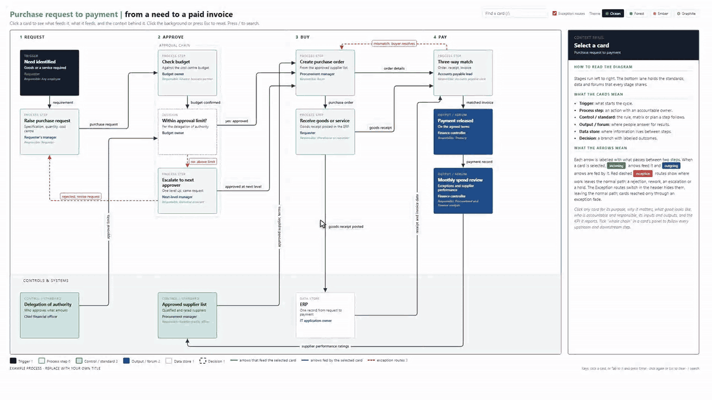

# interactive-workflow

An agent skill for Claude Code, OpenAI Codex, Cursor, OpenCode, Hermes Agent, OpenClaw and other agents that read `SKILL.md`. It turns a process description into a self-contained, clickable HTML diagram: cards on a fixed grid, labelled orthogonal arrows, exception routes you can switch off, a context panel on the right, search, deep links, four colour themes (one dark), and a PNG for slides. One file, no dependencies, works offline, opens in any browser.

Built for process maps, operating models, governance frameworks and work flows where every step has an accountable owner, an input, an output and a KPI. It is not a general drawing tool.

Real processes are more than the happy path. Rejections, rework, escalations and hold points are drawn as red dashed exception routes, so you can see where a process can break. A switch in the header hides them when you want to walk someone through the normal path first.

## What it looks like

A visitor clicking through the purchase example: cards, a decision, the whole-chain trace, Copy link, search and the four themes (sped up 1.5 times; [download the full-resolution MP4](https://github.com/abualnassr/interactive-workflow/raw/main/docs/demo.mp4), 48 s, 4 MB):



Purchase request to payment, Ocean theme (default), with "Escalate to next approver" selected. Arrows that feed it light up in the accent colour, arrows it feeds in the second colour, everything else fades back, and the panel on the right shows its context. The red dashed arrows are exception routes: an escalation, a rejection back to the requester, and rework after a failed three-way match:


The same diagram in the Forest theme, nothing selected, with the exception routes switched off so only the normal path shows:


A second example, incident to improvement, in Graphite (dark):


And in Ember:


Open either HTML file in the `examples` folder in a browser and click a card. The panel shows who is accountable and responsible, what happens, why it matters, what good looks like, what feeds the card, what it feeds, how far its reach goes along the flow, and the KPI it reports. Tick "whole chain" to follow every upstream and downstream step. Untick "Exception routes" in the header to hide the red dashed exception arrows. Esc resets, `/` searches, Copy link gives a link straight to a card, and the buttons top right switch theme. Cards also work from the keyboard: Tab to a card, Enter to select it.

## Install

The skill is a plain `SKILL.md` folder (rules in `SKILL.md`, the page template in `templates/`, the audit in `scripts/`) in the open [Agent Skills](https://agentskills.io) format, so it works in any agent that reads skills, not only Claude.

### Any agent, with the skills CLI (recommended)

```
npx skills add abualnassr/interactive-workflow -g -a <agent>
```

`-g` installs it for your user account (leave it out to install into the current project only). Pass one or more agent ids after `-a`, separated by spaces, or `-a '*'` for every agent the CLI supports:

| Agent | `-a` id |
|---|---|
| Claude Code | `claude-code` |
| OpenAI Codex | `codex` |
| Cursor | `cursor` |
| OpenCode | `opencode` |
| Hermes Agent | `hermes-agent` |
| OpenClaw | `openclaw` |
| GitHub Copilot | `github-copilot` |
| Gemini CLI | `gemini-cli` |
| Windsurf | `windsurf` |
| Cline | `cline` |
| Roo Code | `roo` |
| Kilo Code | `kilo` |
| OpenHands | `openhands` |
| Goose | `goose` |
| Amp | `amp` |
| Continue | `continue` |
| Zed | `zed` |
| Warp | `warp` |
| Qwen Code | `qwen-code` |
| Kiro CLI | `kiro-cli` |
| Junie | `junie` |
| Trae | `trae` |
| Augment | `augment` |
| Droid (Factory) | `droid` |
| AiderDesk | `aider-desk` |

For example, Claude Code, Codex and Hermes Agent in one go:

```
npx skills add abualnassr/interactive-workflow -g -a claude-code codex hermes-agent
```

Run `npx skills add --help` for the full, current list of agents.

### Claude apps (claude.ai, Claude Desktop, Cowork)

Download `interactive-workflow-v*.zip` from the [latest release](https://github.com/abualnassr/interactive-workflow/releases/latest), then in Claude go to Settings, then Skills (Capabilities on some plans), choose Add skill and upload the zip.

### Aider

Aider has no skills folder, so load the file as read-only context for the session:

```
aider --read path/to/interactive-workflow/SKILL.md --read path/to/interactive-workflow/templates/workflow.html
```

or add both under `read:` in `.aider.conf.yml` to load them every time. The audit runs with `/run python path/to/interactive-workflow/scripts/wf_check.py "<file>.html"`.

### By hand

Clone this repository into your agent's skills folder; the repository root is the skill folder:

```
git clone https://github.com/abualnassr/interactive-workflow
```

Keep `SKILL.md`, `templates/` and `scripts/` together. The `examples` and `docs` folders are only for you to look at.

## Use

Ask in plain language, for example:

- "Make an interactive process flow of our change management procedure."
- "Turn this Mermaid flowchart into a clickable workflow with a dark theme."
- "Map our hiring process as an interactive diagram: stages, owners, decisions, systems, plus a PNG for the deck."
- "Interactive process flow of our month-end close, without the bottom lane."
- "Map our work order process, including the exception routes: rejected requests, rework, escalations and parts holds."

The row of shared standards, systems and forums along the bottom is optional. Add "without the bottom lane" (or "no enablers") to your request to leave it out; the agent asks if you don't say.

The agent will ask for whatever the source does not give (stages, cards, arrows, who is accountable), build the page, run a collision audit in a headless browser, and hand back the HTML and PNG.

## Audit and PNG export

The skill checks every diagram for collisions before handing it over, and renders a PNG for slides. Both need a headless browser. The bundled script does both from any shell:

```
pip install playwright
python -m playwright install chromium
python <skill folder>/scripts/wf_check.py "My process - workflow (interactive).html" ocean graphite
```

Use `python3` on macOS and Linux. It prints the audit findings as JSON (an empty list is a pass) and saves one PNG per theme named. The agent runs it for you when it has a shell; agents with their own browser tool (a Playwright or Chrome MCP server, a built-in browser) can use that instead. With neither, the skill still builds the page and says plainly that the audit was not run.

## What the skill enforces

- A fixed grid (180 x 140 px cards, four columns, four rows, an optional enablers lane) so nothing overlaps.
- Explicit orthogonal arrow routes with labels that say what passes, never "next".
- Six card types: trigger, process step, decision, data store, control or standard, output or forum.
- Exception routes (rejections, rework, escalations, holds) in red, dashed, counted in the legend, tagged in the panel, and hidden with one switch.
- An audit (`scripts/audit.js`, run by `scripts/wf_check.py` or any browser tool, at any window size) that fails the build on duplicate ids, arrows to unknown cards, unconnected cards, cards, arrows or labels off the canvas, arrows through cards, arrows on top of each other, labels on cards or on each other, lines through text, titles on cards, clipped card text, and console errors.
- Four themes as CSS variables: Ocean, Forest, Ember, Graphite. Add a client brand by copying one block.

## Notes

- Made for a laptop or desktop screen. On a phone the whole page scales down to fit, so pinch to zoom.
- The page uses the Inter font when installed and falls back to Segoe UI or Arial.
- A viewer's theme choice is remembered for that page only; `?theme=graphite` (or any theme name) in the URL forces one.
- `?exceptions=off` in the URL opens the page with the exception routes hidden.
- In a plain chat with no shell or browser (claude.ai without code execution, for example) the skill builds the page and tells you the audit was not run.
- Feedback arrows (into the trigger, or marked `back:true`) are drawn but not followed when counting reach, so the numbers mean something.

## Licence

MIT. Copyright 2026 Bandar Abualnassr.
